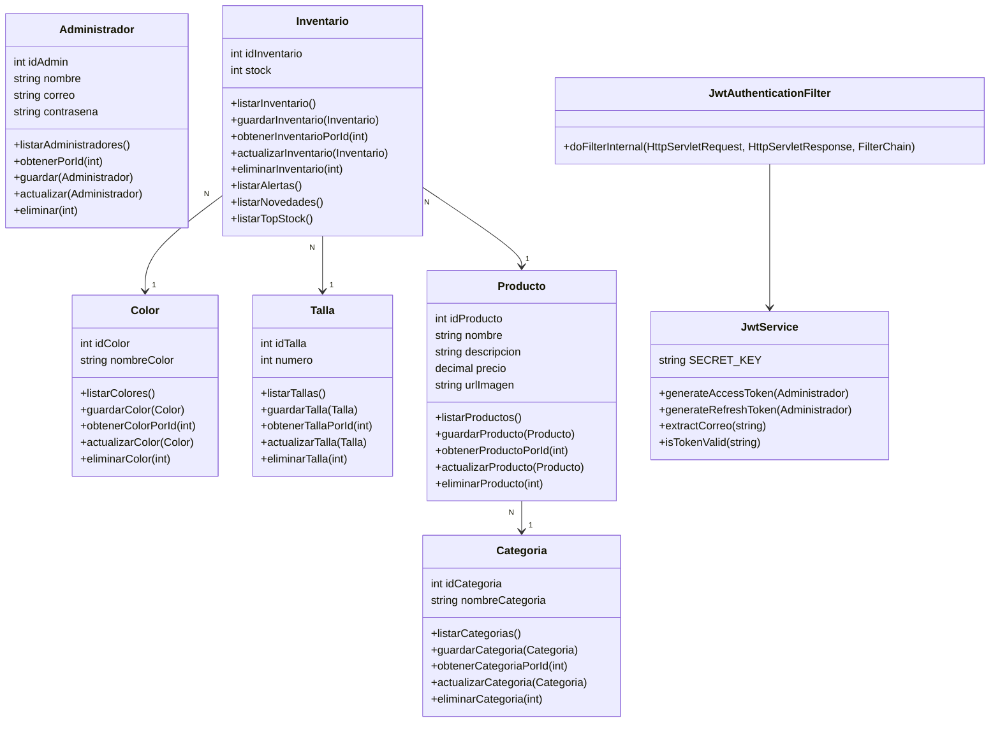

# Gata Shoes — Sistema de Inventario

Sistema web de gestión de inventario para Gata Shoes con arquitectura REST API + Frontend React.

## Stack Tecnológico

### Backend
- **Java 17** + **Spring Boot 3.3.5**
- **Spring Data JPA** + **Hibernate 6.5.3**
- **MySQL 8.0**
- Maven para gestión de dependencias

### Frontend
- **React 18** + **TypeScript**
- **Vite** (build tool)
- **Tailwind CSS** para estilos
- **Axios** para llamadas API
- **React Router** para navegación

## 📖 Historias de Usuario

| HU | Título | Módulo Frontend | Endpoint Backend |
|----|--------|-----------------|-----------------|
| HU-01 | Autenticación de usuario | LoginPage.tsx | POST /api/v1/auth/login |
| HU-02 | Tablero de Control (Dashboard) | ResumenPage.tsx | GET /api/v1/resumen |
| HU-03 | Registro de nuevas variantes | ResumenPage.tsx (Modal) | POST /api/v1/productos + POST /api/v1/inventario |
| HU-04 | Auditoría de ingresos recientes | ResumenPage.tsx (Nuevos Ingresos) | GET /api/v1/resumen (novedades) |
| HU-05 | Ajuste manual de stock | InventarioPage.tsx | PUT /api/v1/inventario/{id} / DELETE /api/v1/inventario/{id} |
| HU-06 | Administración de categorías | CategoriasPage.tsx | GET/POST/PUT/DELETE /api/v1/categorias |

### Descripción detallada de Historias de Usuario

**HU-01: Autenticación de usuario**
Como Encargado de Bodega, necesito ingresar mis credenciales para restringir el acceso al sistema de inventarios.
- Implementada con: Spring Security + JWT (access token 15 min + refresh token 7 días en HttpOnly cookie) + ProtectedRoute en React
- Campos: email (validación regex en español) + contraseña
- Respuesta: access_token (Bearer) + refresh_token (HttpOnly cookie)

**HU-02: Tablero de Control (Dashboard)**
Como Administrador, necesito un panel centralizado con KPIs (variantes, stock total, alertas), gráfico de distribución por categoría, panel de novedades y tabla Top 3 mayor stock.
- Endpoint: GET /api/v1/resumen (retorna ResumenData con 6 métricas)
- Componentes visuales: MetricCard (KPIs), gráfico de pastel, tabla de novedades, top stock

**HU-03: Registro de nuevas variantes**
Como Encargado de Inventario, necesito un formulario para dar de alta nuevos modelos con nombre, categoría, precio, talla, color, stock inicial e imagen.
- Crea registro en Producto table e Inventario table
- Requiere: nombre, descripción, precio, categoría, talla, color, stock inicial, urlImagen
- Modal en ResumenPage con validación de campos

**HU-04: Auditoría de ingresos recientes**
Como Auditor, necesito ver los últimos 5 artículos ingresados ordenados por idInventario descendente para validar contra planillas físicas.
- Endpoint: GET /api/v1/resumen → novedades (últimos 5)
- Tabla con columnas: Producto, Talla, Color, Stock, Fecha
- Ordenamiento: descendente por ID

**HU-05: Ajuste manual de stock**
Como Encargado de Bodega, necesito ajustar stock con tres modos: Añadir, Restar o Fijar Total.
- Si el stock llega a 0 la variante se elimina del inventario conservando el producto en el catálogo
- Endpoints: PUT /api/v1/inventario/{id} (actualizar) + DELETE /api/v1/inventario/{id} (eliminar si es 0)
- Modal con opciones de operación y cantidad

**HU-06: Administración de categorías**
Como Administrador, necesito gestionar categorías (CRUD completo) con formulario modal, validaciones y actualización automática del listado.
- CRUD completo: GET, POST, PUT, DELETE
- Interfaz: tabla de categorías + modal de edición/creación
- Validaciones: nombre no vacío, máximo 50 caracteres

---

## 📊 Diagrama de Clases



---

## 🔧 Estándares de Codificación

### Backend (Java - Spring Boot)

#### Nomenclatura

- **Clases**: PascalCase (ej: `InventarioService`, `CategoriaMapper`)
- **Métodos y variables**: camelCase (ej: `listarCategorias`, `idInventario`)
- **Constantes**: UPPER_SNAKE_CASE (ej: `ACCESS_TOKEN_EXPIRATION`)
- **Paquetes**: minúsculas con puntos (ej: `com.gatashoes.inventario.api.controller`)

#### Estructura de paquetes (Arquitectura en capas)

```
com.gatashoes.inventario/
├── api/
│   ├── controller/      → @RestController — expone endpoints REST
│   ├── dto/
│   │   ├── request/     → DTOs de entrada (lo que recibe la API)
│   │   └── response/    → DTOs de salida (lo que retorna la API)
│   ├── exception/       → Manejo global de errores (@RestControllerAdvice)
│   ├── mapper/          → Conversión Entity ↔ DTO (métodos estáticos)
│   └── security/        → JWT Filter, JWT Service, Auth Service
├── config/              → Configuración Spring (SecurityConfig)
├── model/               → Entidades JPA (@Entity)
├── repository/          → Interfaces JPA (@Repository)
└── service/             → Lógica de negocio (@Service)
```

#### Principios aplicados

- **Single Responsibility**: Cada clase tiene una única responsabilidad
- **DTO Pattern**: Los Controllers nunca exponen Entities directamente
- **Repository Pattern**: Acceso a datos exclusivamente a través de JpaRepository
- **Stateless**: Sin sesiones HTTP — autenticación basada en JWT
- **CORS centralizado**: Configurado en SecurityConfig, no en cada Controller

#### Convenciones de métodos en Services

- `listar[Entidad]s()` → retorna `List`
- `obtener[Entidad]PorId(id)` → retorna `Entidad` o `null`
- `obtener[Entidad]PorIdOrThrow(id)` → retorna `Entidad` o lanza `ResourceNotFoundException`
- `guardar(Entidad)` → retorna `Entidad` guardada
- `actualizar(Entidad)` → retorna `Entidad` actualizada
- `eliminar(int id)` → `void`, valida existencia antes de eliminar

#### Manejo de errores

- `ResourceNotFoundException` → HTTP 404
- `MethodArgumentNotValidException` → HTTP 400 con detalle por campo
- `Exception` genérica → HTTP 500
- Formato estándar: `{ timestamp, status, error, message, path }`

### Frontend (React + TypeScript)

#### Nomenclatura

- **Componentes**: PascalCase (ej: `ResumenPage`, `MetricCard`, `MainLayout`)
- **Hooks**: camelCase con prefijo "use" (ej: `useAuth`, `useState`)
- **Funciones**: camelCase (ej: `fetchResumen`, `handleSubmit`)
- **Constantes**: camelCase (ej: `accessToken`, `authUser`)
- **Archivos de componentes**: PascalCase.tsx
- **Archivos de utilidades**: camelCase.ts

#### Estructura de carpetas

```
frontend/src/
├── api/             → axiosClient.ts — cliente HTTP centralizado
├── components/
│   ├── layout/      → Sidebar, TopBar, MainLayout (componentes transversales)
│   └── ui/          → Button, Modal, MetricCard, PageHeader (componentes reutilizables)
├── contexts/        → AuthContext.tsx — estado global de autenticación
├── hooks/           → useAuth.ts — hooks personalizados
├── pages/           → Una carpeta por página (LoginPage, ResumenPage, etc.)
└── types/           → index.ts — interfaces TypeScript del dominio
```

#### Principios aplicados

- **Componentes reutilizables**: Sidebar, TopBar y MainLayout son transversales
- **Context API**: Estado de autenticación centralizado en AuthContext
- **TypeScript estricto**: Todas las interfaces definidas en `types/index.ts`
- **Separación de responsabilidades**:
  - `pages/` → lógica de negocio y estado local
  - `components/` → presentación y reutilización
  - `api/` → llamadas HTTP centralizadas
- **Interceptores Axios**: Token JWT agregado automáticamente en cada request
- **Validación en cliente**: Validaciones en español antes de llamar al backend

#### Convenciones de componentes

- Props tipadas con interface TypeScript
- Estados locales con `useState`
- Efectos secundarios con `useEffect`
- Formularios con estado controlado (controlled components)
- Nombres de handlers: `handle[Acción]` (ej: `handleSubmit`, `handleDelete`)
- Nombres de fetchers: `fetch[Entidad]` (ej: `fetchProductos`, `fetchResumen`)

---

## Instalación y Ejecución

### Requisitos previos
- Java 17+
- Node.js 18+ / npm 10+
- MySQL 8.0 (Docker recomendado)
- Git

### Backend

```bash
cd inventario
.\mvnw.cmd spring-boot:run
```

Backend estará disponible en: **http://localhost:8081**

### Frontend

```bash
cd frontend
npm install
npm run dev
```

Frontend estará disponible en: **http://localhost:5173**

## URLs y Acceso

| Componente | URL |
|-----------|-----|
| Frontend | http://localhost:5173 |
| Backend API | http://localhost:8081/api/v1 |

### Credenciales de Prueba
- **Correo**: admin@gatashoes.com
- **Contraseña**: 123456

## Endpoints REST Principales

### Autenticación
- `POST /api/v1/auth/login` — Login

### Categorías
- `GET /api/v1/categorias` — Listar
- `POST /api/v1/categorias` — Crear
- `PUT /api/v1/categorias/{id}` — Actualizar
- `DELETE /api/v1/categorias/{id}` — Eliminar

### Colores
- `GET /api/v1/colores` — Listar
- `POST /api/v1/colores` — Crear
- `PUT /api/v1/colores/{id}` — Actualizar
- `DELETE /api/v1/colores/{id}` — Eliminar

### Tallas
- `GET /api/v1/tallas` — Listar
- `POST /api/v1/tallas` — Crear
- `PUT /api/v1/tallas/{id}` — Actualizar
- `DELETE /api/v1/tallas/{id}` — Eliminar

### Productos
- `GET /api/v1/productos` — Listar
- `POST /api/v1/productos` — Crear
- `PUT /api/v1/productos/{id}` — Actualizar
- `DELETE /api/v1/productos/{id}` — Eliminar

### Inventario
- `GET /api/v1/inventario` — Listar variantes
- `POST /api/v1/inventario` — Crear variante
- `PUT /api/v1/inventario/{id}` — Actualizar
- `DELETE /api/v1/inventario/{id}` — Eliminar

### Resumen y Alertas
- `GET /api/v1/resumen` — Dashboard (totales, novedades, top stock)
- `GET /api/v1/alertas` — Stock bajo (≤ 3 unidades)

## Estructura del Proyecto

```
Gata-Shoes-Inventario/
├── inventario/                          # Backend (Spring Boot)
│   ├── src/main/java/com/gatashoes/inventario/
│   │   ├── api/
│   │   │   ├── controller/             # REST Controllers
│   │   │   ├── dto/                    # Data Transfer Objects
│   │   │   ├── security/               # JWT & Security
│   │   │   └── exception/              # Global error handling
│   │   ├── config/                     # Configuration (Security, CORS)
│   │   ├── model/                      # JPA Entities
│   │   ├── repository/                 # Data Access Layer
│   │   └── service/                    # Business Logic
│   ├── pom.xml
│   └── mvnw / mvnw.cmd                 # Maven wrapper
│
├── frontend/                            # Frontend (React)
│   ├── src/
│   │   ├── pages/                      # Page components
│   │   ├── components/                 # Reusable components
│   │   ├── api/                        # Axios client & endpoints
│   │   ├── contexts/                   # Auth context
│   │   ├── hooks/                      # Custom hooks
│   │   ├── types/                      # TypeScript types
│   │   └── App.tsx                     # Routing & layout
│   ├── package.json
│   ├── vite.config.ts
│   └── tailwind.config.js
│
└── README.md                            # Este archivo
```

## Características Principales

### Módulos Implementados
- ✅ Autenticación JWT
- ✅ Dashboard (Resumen con métricas, gráficos, últimas novedades)
- ✅ Gestión de Categorías
- ✅ Gestión de Productos
- ✅ Alertas de Stock Bajo
- ✅ Interfaz responsive con Tailwind CSS

## Seguridad

- **CORS**: Configurado para `http://localhost:5173`
- **JWT**: Token Bearer en header `Authorization`
- **Session**: STATELESS (sin sesiones de servidor)
- **Endpoints protegidos**: `/api/v1/**` requiere autenticación
- **Endpoints públicos**: `/api/v1/auth/**`

## Desarrollo

### Scripts útiles

#### Backend
```bash
# Compilar
./mvnw clean compile

# Tests
./mvnw test

# Empaquetar JAR
./mvnw clean package

# Ejecutar JAR
java -jar target/inventario-0.0.1-SNAPSHOT.jar
```

#### Frontend
```bash
# Dev server
npm run dev

# Build para producción
npm run build

# Preview build
npm run preview

# Linting (TypeScript)
npm run build  # Incluye verificación tsc
```

## Contribuciones

Para contribuir:
1. Fork el repositorio
2. Crea una rama (`git checkout -b feature/nueva-funcion`)
3. Commit cambios (`git commit -m 'Agrega nueva función'`)
4. Push a la rama (`git push origin feature/nueva-funcion`)
5. Abre un Pull Request

## Licencia

Propietario — Gata Shoes

## Contacto

Para soporte o preguntas sobre el proyecto, contacta al equipo de desarrollo.

---

**Última actualización**: Junio 2026
